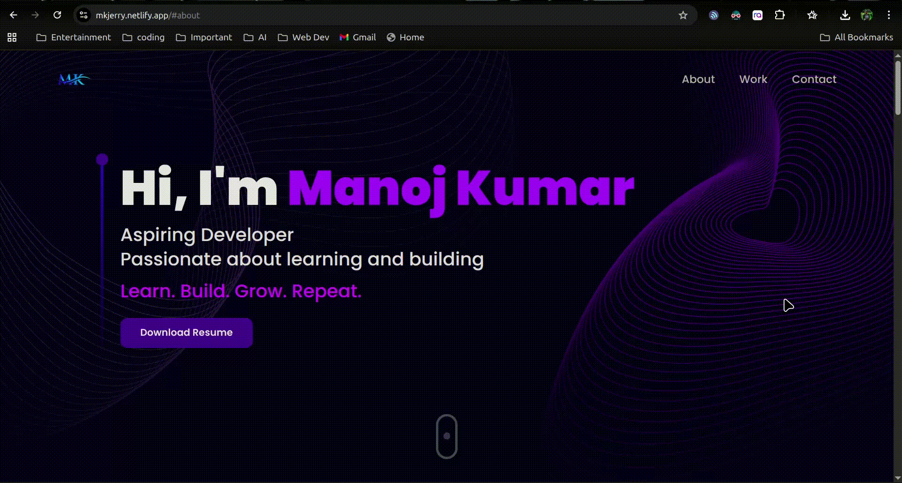

# 💼 Personal Portfolio Website

Welcome to my personal developer portfolio! 🚀  
This site was crafted with passion using **React**, showcasing my projects, skills, and journey as a Frontend Developer.

## 🌐 Live Preview: 🔗 [Click to visit My Portfolio](https://mkjerry.netlify.app/)  
## 🎥 Demo Video [May not be the exact same in future updates] 



## ✨ Features

- 🌙 **Dark Mode** UI with sleek sky blue highlights
- 💬 **Testimonials** section
- 📄 One-click **Resume Download** button
- 📱 Fully **Responsive Design** (Mobile + Desktop)


---

## 🛠️ Tech Stack

| Tech         | Usage                       |
|--------------|-----------------------------|
| **React**    | Core frontend framework     |
| **HTML5**    | Structure of the website    |
| **Tailwind CSS**     | Custom styling              |
| **JavaScript** | Frontend logic & interactivity |
| **Vite.Js**     | fast development server             |
| **Framer Motion** | Animations              |
| **Netlify** | Deployment               |

---


## 📁 Getting Started

Clone the repo and run locally:

```bash
git clone https://github.com/Mkjerry-jr/REAL-PORTFOLIO.git
npm install
npm start
